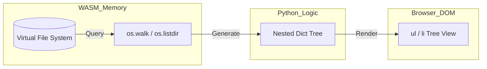

# Virtual FS Explorer

## Context
Pyodide operates within a private, virtualized file system (Emscripten's MEMFS/IDBFS). While Python code can easily interact with this filesystem using standard `os` and `open()` calls, the user cannot see or manage these files without a visual interface.

## Problem
How can we visualize the state of the Pyodide Virtual File System (VFS) to help users manage their local data, debug file I/O operations, or navigate project structures?

## Forces
*   **Virtualization**: The VFS is isolated from the host OS and only accessible via Python/WASM.
*   **Tree Walking**: Navigating a filesystem is a recursive operation that can be performance-heavy for very deep trees.
*   **Interactivity**: Users expect standard UI metaphors (folders, icons, file sizes) for filesystem navigation.
*   **Permissions**: Some system directories (like `/dev` or `/proc`) may behave differently or be restricted.

## Solution
Create a **VFS Controller** in Python that uses the `os` module to walk the directory tree and generates a corresponding DOM structure.

1.  **Recursive Walker**: Implement a Python function that converts the directory structure into a nested data structure (JSON-serializable).
2.  **Tree Renderer**: Use a recursive UI function (or VDOM) to transform the data structure into nested HTML lists (`<ul>`/`<li>`).
3.  **State Synchronization**: Provide a "refresh" mechanism to re-sync the UI whenever files are added or modified by other parts of the Python application.

### VFS Mapping Flow


## Implementation

### The VFS Controller (`vfs_controller.py`)
```python
import os, js

def get_tree(path="/"):
    node = {"name": os.path.basename(path) or "root", "type": "dir", "children": []}
    for item in os.listdir(path):
        full_path = os.path.join(path, item)
        if os.path.isdir(full_path):
            node["children"].append(get_tree(full_path))
        else:
            node["children"].append({"name": item, "type": "file"})
    return node
```

## Resulting Context
*   **Pros**: Provides transparency into the virtualized environment. Crucial for data-heavy apps or educational tools.
*   **Cons**: Recursive walking of the entire `/` root can be slow (contains thousands of Python standard library files). Best restricted to a `/data` or `/home` mount.

## Related Patterns
*   **Persistent File System (IDBFS)**: The FS Explorer is the perfect companion for managing persistent user data.
*   **Virtual Terminal**: Can be used together to create a full "Web IDE" experience.

## Verification
*   **Example**: `examples/loading/vfs_explorer.html`
*   **Test**: `tests/patterns/architectural/test_vfs_explorer.py`
