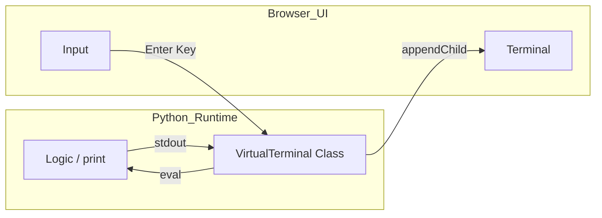

# Virtual Terminal

## Context
Pyodide applications run in a headless environment from the perspective of the Python interpreter. Standard input/output functions like `print()` and `input()` are directed to the browser's console by default, which is invisible to the end user.

## Problem
How can we provide a user-facing command-line interface (CLI) or terminal within the browser that correctly captures all Python output and allows for interactive user input?

## Forces
*   **Redirection**: Python's `sys.stdout` and `sys.stderr` are global streams that must be intercepted.
*   **Asynchronicity**: Capturing input in a browser is event-driven, while Python's `input()` is traditionally blocking.
*   **Formatting**: Standard terminal output often includes ANSI codes or expects a fixed-width font.
*   **Developer Experience**: Developers want to use standard `print()` statements without worrying about the browser UI.

## Solution
Create a **Virtual Terminal Bridge** that implements the Python file-like object interface (`write` and `flush`) and binds it to a DOM element.

1.  **Intercept Streams**: Redirect `sys.stdout` and `sys.stderr` to a custom Python class.
2.  **DOM Binding**: The custom class should create or append to DOM nodes whenever `write()` is called.
3.  **Input Handling**: Bind a JS `keydown` event to a Python handler that evaluates the input and prints the result back to the intercepted stream.

### Terminal Flow


## Implementation

### The Terminal Controller (`terminal_controller.py`)
```python
import sys, js

class VirtualTerminal:
    def __init__(self, output_id):
        self.output_el = js.document.getElementById(output_id)
        sys.stdout = self
        sys.stderr = self

    def write(self, text):
        span = js.document.createElement("span")
        span.innerText = text
        self.output_el.appendChild(span)
```

## Resulting Context
*   **Pros**: Full visibility of Python output for the user. Enables building REPLs, debug consoles, and interactive tutorials.
*   **Cons**: May require handling complex terminal features like cursor control or colors. Performance can degrade if extremely large amounts of text are printed rapidly.

## Related Patterns
*   **Console Log Capturing**: Redirection can also be mirrored to the browser console for developer debugging.
*   **Reactive UI Patterns**: For more complex, structured output, a VDOM approach might be better than raw text appending.

## Verification
*   **Example**: `examples/loading/virtual_terminal.html`
*   **Test**: `tests/patterns/architectural/test_terminal.py`
