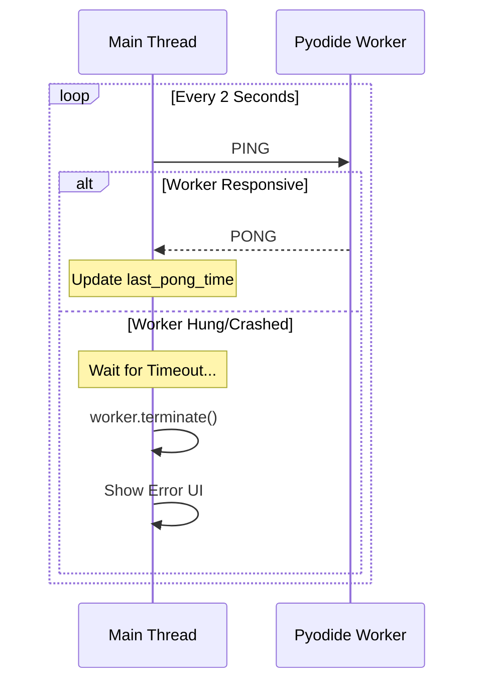

# Worker Heartbeat

## Context
When running Pyodide in a Web Worker, the worker may crash or hang due to factors outside the main thread's control: memory exhaustion (OOM), infinite loops in Python code, or unhandled WASM exceptions. 

## Problem
Web Workers often "fail silently." The `worker.onerror` event does not fire for infinite loops that block the event loop, and some memory-related crashes simply cause the worker to stop responding without notifying the parent thread. This leaves the UI in a "perpetual loading" state.

## Forces
*   **Event Loop Blocking**: If Python enters an infinite loop, the worker's event loop is occupied and cannot process incoming messages or fire error events.
*   **Resource Isolation**: The main thread has no direct visibility into the worker's CPU or memory usage.
*   **User Experience**: Users need to know immediately if a background task has failed so they can restart it or save their work.

## Solution
Implement a **Ping/Pong Heartbeat** mechanism managed by the main thread.

1.  **Periodic Ping**: The main thread sends a `"PING"` message to the worker at regular intervals (e.g., every 2 seconds).
2.  **Immediate Pong**: The worker script is designed to respond with a `"PONG"` message as soon as it receives a ping.
3.  **Liveness Timeout**: The main thread maintains a `last_pong_time` timestamp. If the difference between the current time and the last pong exceeds a threshold (e.g., 5 seconds), the worker is considered "dead" or "hung."
4.  **Recovery**: The main thread terminates the unresponsive worker and notifies the user or attempts a restart.

### Heartbeat Sequence


## Implementation

### Main Thread Manager
```javascript
let lastPong = Date.now();
const worker = new Worker('worker.js');

setInterval(() => {
    if (Date.now() - lastPong > 5000) {
        console.error("Worker is unresponsive!");
        worker.terminate();
    }
    worker.postMessage({ type: 'PING' });
}, 2000);

worker.onmessage = (e) => {
    if (e.data.type === 'PONG') lastPong = Date.now();
};
```

## Resulting Context
*   **Pros**: Robustly detects all classes of "silent" failures, including infinite loops. Prevents the application from hanging indefinitely.
*   **Cons**: Adds a small amount of message-passing overhead. Requires the worker script to have a top-level message handler for pings.

## Related Patterns
*   **Worker Load Failure**: For detecting issues *during* startup.
*   **Worker Pool**: Pools should implement heartbeats for each member to ensure tasks aren't dispatched to dead workers.

## Verification
*   **Example**: `examples/loading/worker_heartbeat.html`
*   **Test**: `tests/patterns/workers/test_heartbeat.py`
