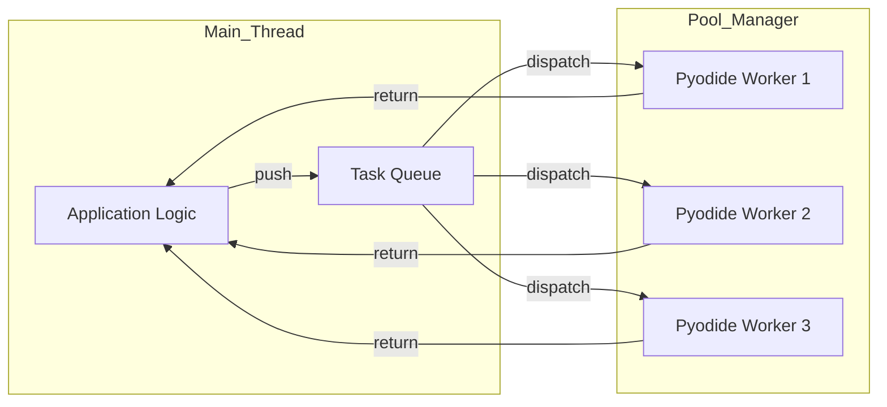

# Worker Pool Pattern

## Context
Pyodide is a heavy runtime. Spawning it requires significant CPU and memory. In many applications, you need to process multiple independent items (e.g., a list of CSV files or a batch of images). Doing this sequentially is slow, and spawning a new worker for every single item will crash the browser due to resource exhaustion.

## Problem
How can we run multiple Python tasks in parallel while keeping the memory footprint stable and avoiding the "Cold Start" penalty for every task?

## Forces
*   **Startup Overhead**: Spawning Pyodide takes seconds. Reusing workers is essential.
*   **Resource Limits**: Browsers limit concurrent workers and memory per tab.
*   **Parallelism**: Users expect performance gains proportional to their CPU core count.
*   **WASM Heap**: Each Pyodide instance allocates its own WASM heap (defaulting to 16MB and growing).

## Solution
Implement a **Worker Pool** that manages a fixed set of "Warm" Pyodide workers and a **Task Queue**.

### Worker Pool Architecture


1.  **Fixed Size**: Determine the pool size based on `navigator.hardwareConcurrency`.
2.  **Pre-Initialization**: Bootstrap all workers in parallel during the application's splash screen.
3.  **Task Queuing**: If all workers are busy, store tasks in a queue and dispatch them as workers become available.
4.  **RPC Layer**: Use an RPC library like Comlink to simplify communication with the pool members.

## Implementation

### The Pool Manager (`pool_manager.js`)
```javascript
class PyodidePool {
    constructor(workerUrl, size = 4) {
        this.workers = Array.from({ length: size }, () => ({
            proxy: Comlink.wrap(new Worker(workerUrl)),
            busy: false
        }));
        this.queue = [];
    }

    async run(code) {
        // Find available worker or queue the task...
    }
}
```

### Usage
```javascript
const pool = new PyodidePool('worker.js', 4);
await pool.init();

// Parallel execution
const results = await Promise.all([
    pool.run("heavy_logic(1)"),
    pool.run("heavy_logic(2)")
]);
```

## Resulting Context
*   **Pros**: Dramatically improves throughput for batch tasks. Prevents browser crashes by capping resource usage. Workers stay "warm" (packages already loaded).
*   **Cons**: Increases initial memory footprint (N times Pyodide's base memory). Requires managing worker state.

## Related Patterns
*   **Worker RPC**: The mechanism for communicating with pool members.
*   **Bootstrapping**: Usually combined with the pool initialization.
*   **Proxy Memory Management**: Critical to clean up data after each pool task.

## Verification
*   **Example**: `examples/workers/worker_pool.html`
*   **Test**: `tests/patterns/workers/test_pool.py`
